# Online Shopping System - UML Diagrams

## Table of Contents
1. [Use Case Diagram](#1-use-case-diagram)
2. [Class Diagrams](#2-class-diagrams)
3. [Sequence Diagrams](#3-sequence-diagrams)
4. [Component Diagram](#4-component-diagram)
5. [Activity Diagrams](#5-activity-diagrams)

---

## 1. Use Case Diagram

### 1.1 Overall System Use Cases

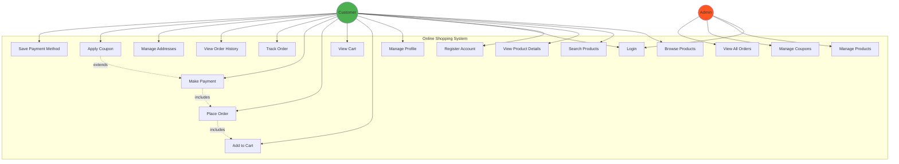

---

## 2. Class Diagrams

### 2.1 User Auth Service - Class Diagram

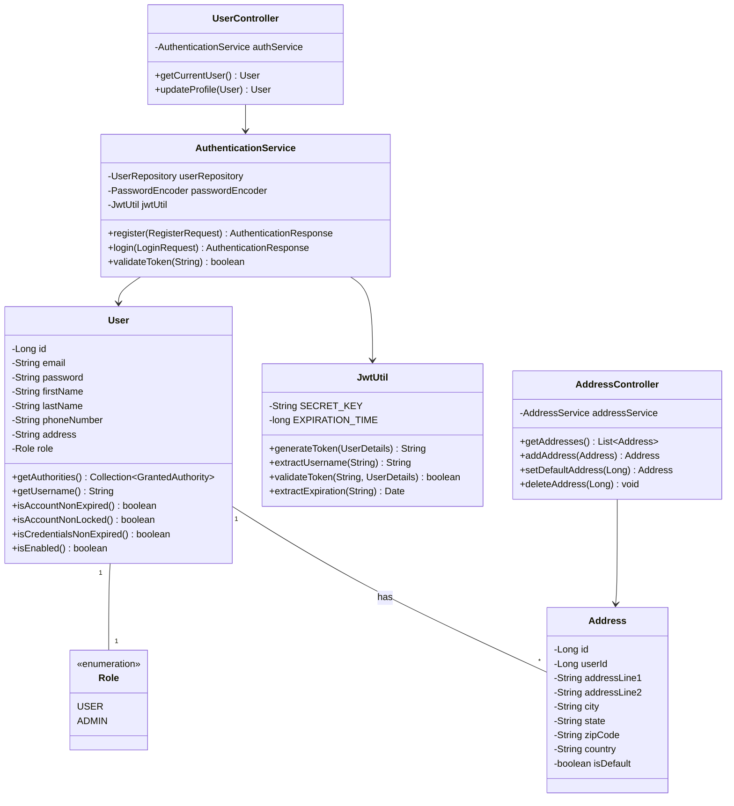

### 2.2 Product Service - Class Diagram

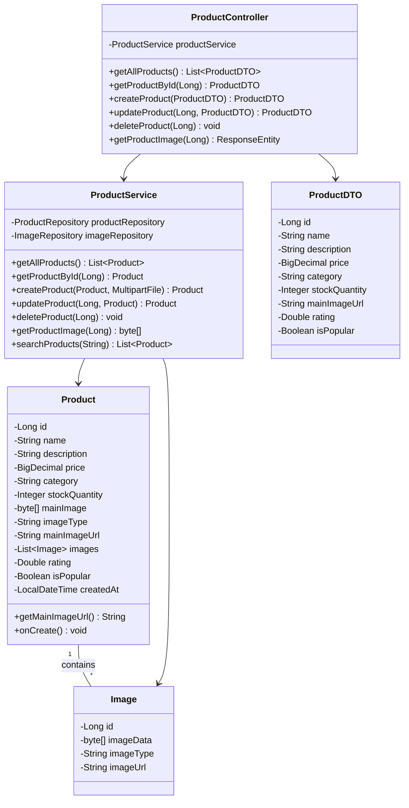

### 2.3 Order Service - Class Diagram

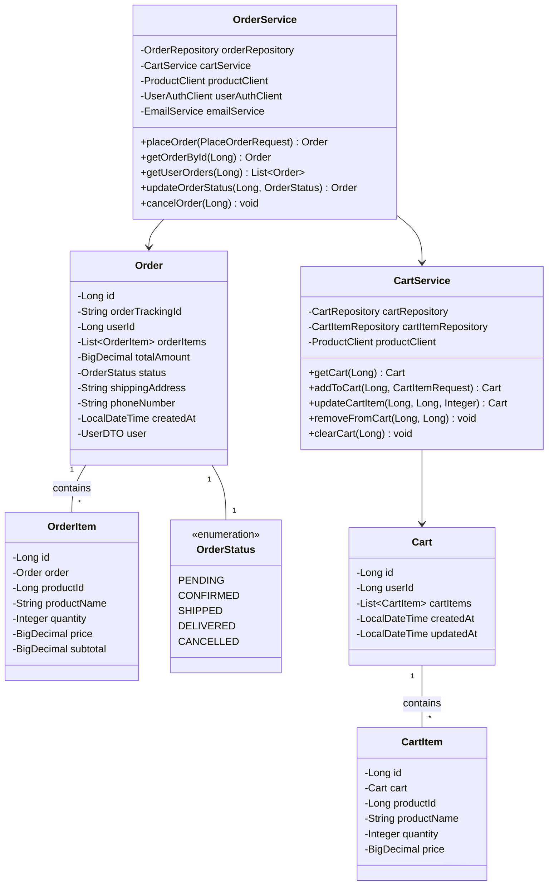

### 2.4 Payment Service - Class Diagram

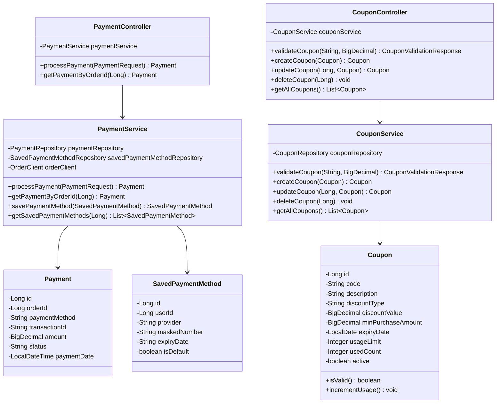

---

## 3. Sequence Diagrams

### 3.1 User Registration and Login

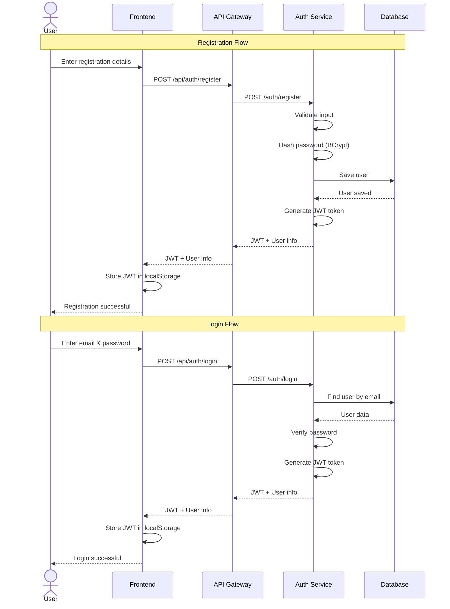

### 3.2 Browse and Add to Cart

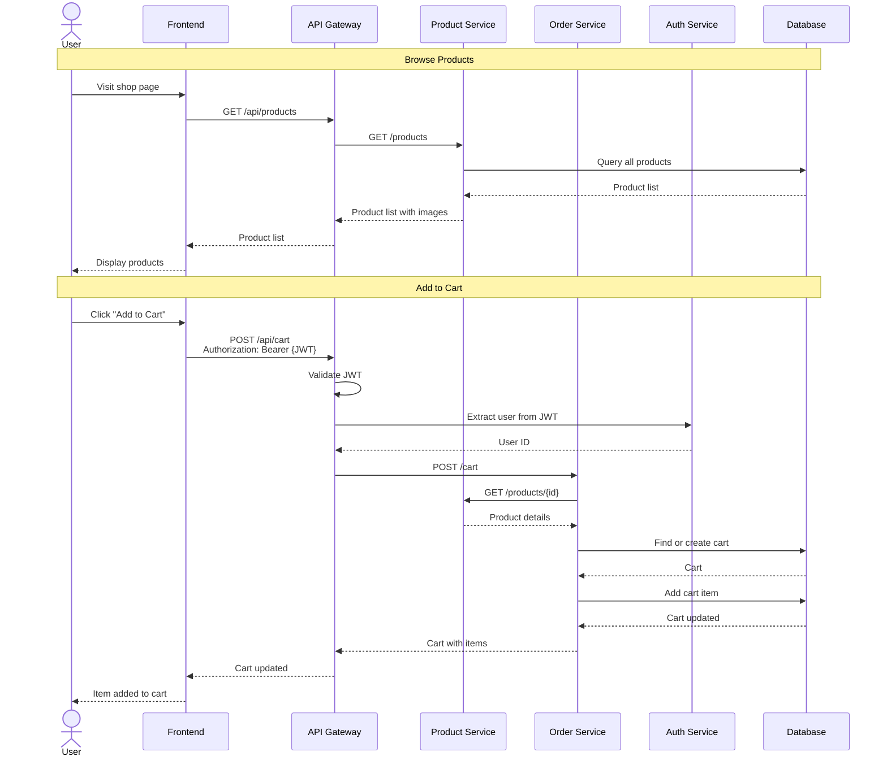

### 3.3 Checkout and Place Order

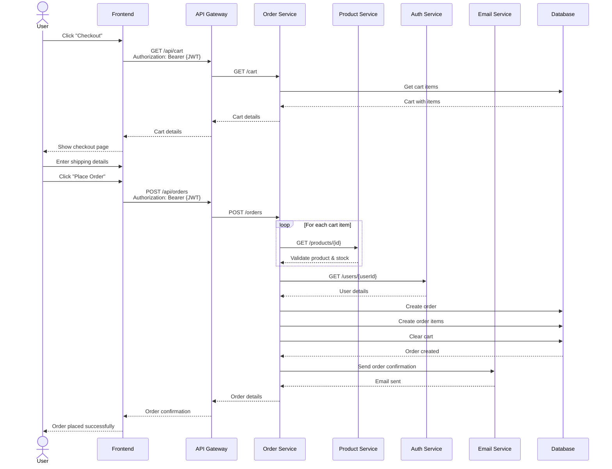

### 3.4 Payment Processing

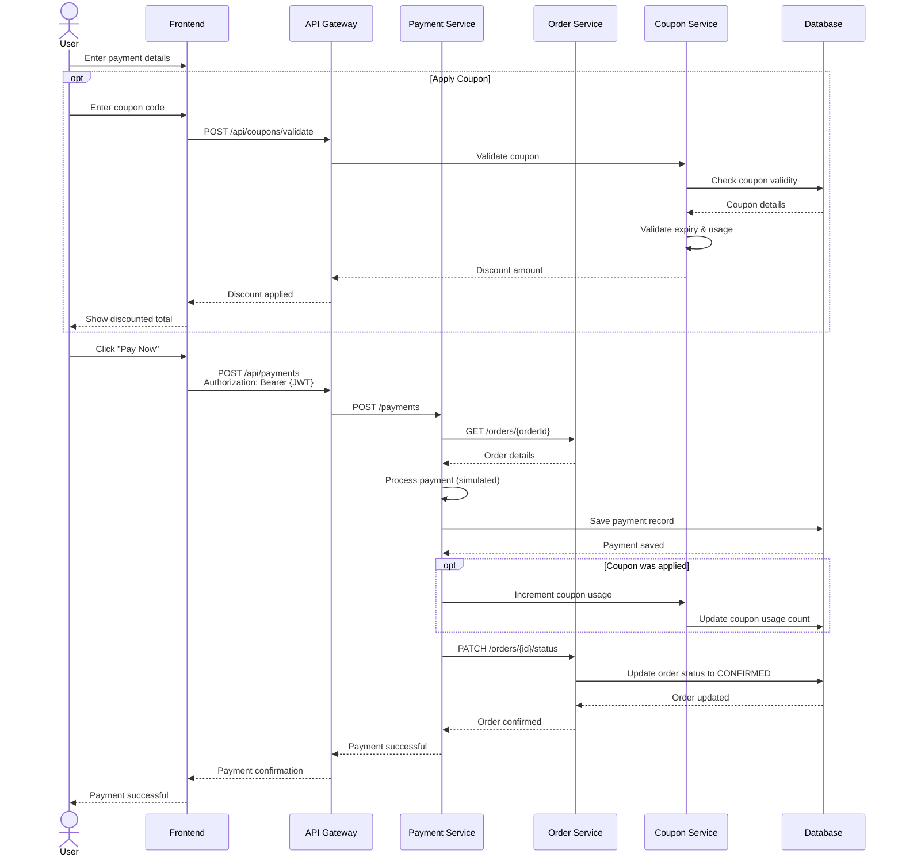

### 3.5 Admin - Manage Products

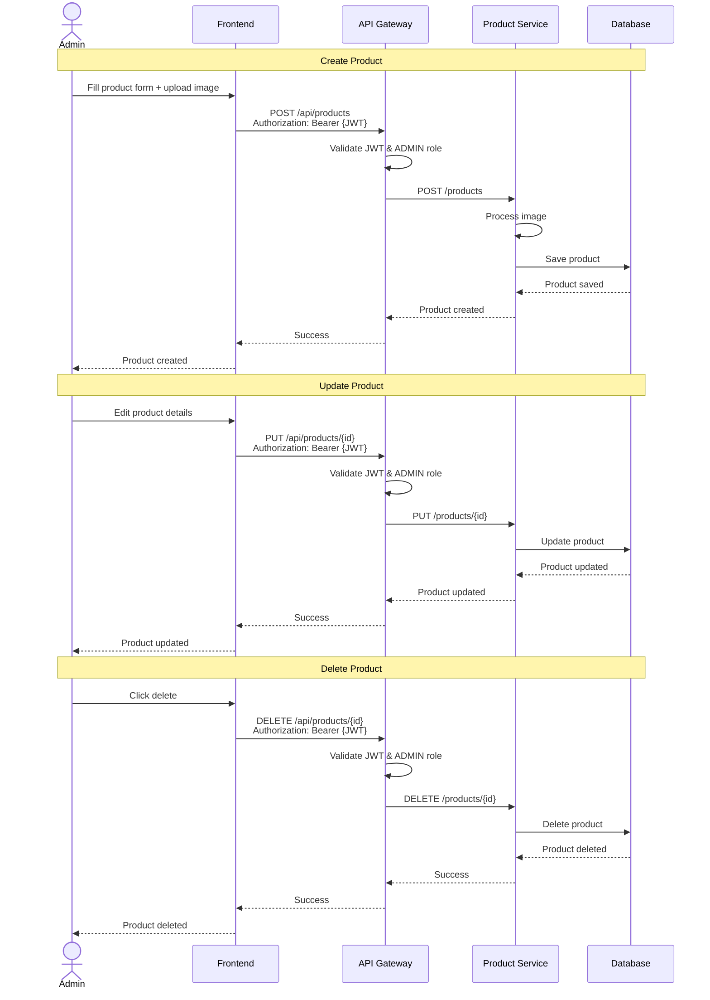

---

## 4. Component Diagram

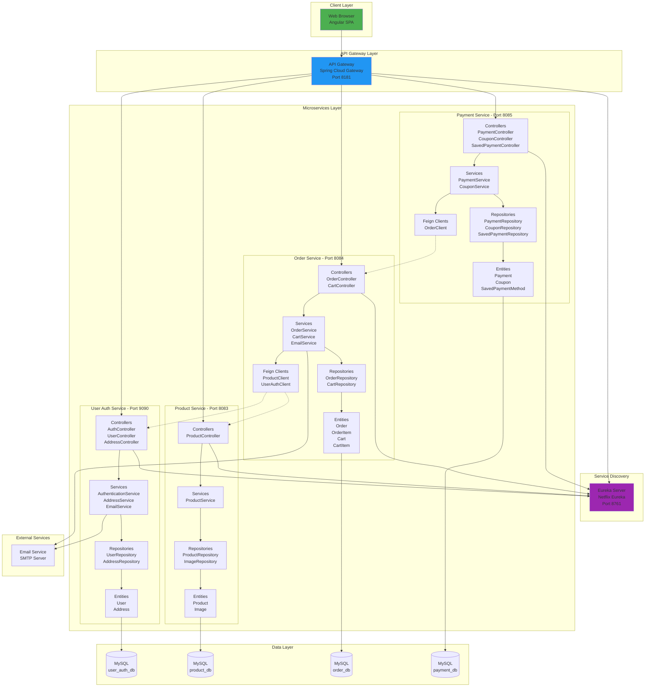

---

## 5. Activity Diagrams

### 5.1 Complete Shopping Flow

```mermaid
flowchart TD
    Start([User Visits Website]) --> Browse[Browse Products]
    Browse --> Search{Search/Filter?}
    Search -->|Yes| ApplyFilter[Apply Filters]
    Search -->|No| ViewProduct[View Product Details]
    ApplyFilter --> ViewProduct
    
    ViewProduct --> AddCart{Add to Cart?}
    AddCart -->|No| Browse
    AddCart -->|Yes| CheckAuth{Authenticated?}
    
    CheckAuth -->|No| Login[Login/Register]
    Login --> AddToCart[Add Item to Cart]
    CheckAuth -->|Yes| AddToCart
    
    AddToCart --> ContinueShopping{Continue Shopping?}
    ContinueShopping -->|Yes| Browse
    ContinueShopping -->|No| ViewCart[View Cart]
    
    ViewCart --> ModifyCart{Modify Cart?}
    ModifyCart -->|Yes| UpdateCart[Update Quantities/Remove Items]
    UpdateCart --> ViewCart
    ModifyCart -->|No| Checkout[Proceed to Checkout]
    
    Checkout --> EnterShipping[Enter Shipping Address]
    EnterShipping --> ReviewOrder[Review Order]
    ReviewOrder --> ApplyCoupon{Apply Coupon?}
    ApplyCoupon -->|Yes| ValidateCoupon[Validate Coupon Code]
    ValidateCoupon --> CouponValid{Coupon Valid?}
    CouponValid -->|No| ReviewOrder
    CouponValid -->|Yes| ApplyDiscount[Apply Discount]
    ApplyDiscount --> SelectPayment
    ApplyCoupon -->|No| SelectPayment[Select Payment Method]
    
    SelectPayment --> SavedPayment{Use Saved Payment?}
    SavedPayment -->|Yes| ProcessPayment[Process Payment]
    SavedPayment -->|No| EnterPayment[Enter Payment Details]
    EnterPayment --> SaveOption{Save Payment Method?}
    SaveOption -->|Yes| SavePaymentMethod[Save Payment Method]
    SaveOption -->|No| ProcessPayment
    SavePaymentMethod --> ProcessPayment
    
    ProcessPayment --> PaymentSuccess{Payment Successful?}
    PaymentSuccess -->|No| PaymentFailed[Show Error Message]
    PaymentFailed --> SelectPayment
    PaymentSuccess -->|Yes| CreateOrder[Create Order]
    
    CreateOrder --> SendEmail[Send Confirmation Email]
    SendEmail --> ClearCart[Clear Shopping Cart]
    ClearCart --> ShowConfirmation[Show Order Confirmation]
    ShowConfirmation --> TrackOrder{Track Order?}
    TrackOrder -->|Yes| OrderTracking[View Order Status]
    TrackOrder -->|No| End([End])
    OrderTracking --> End

    style Start fill:#4CAF50
    style End fill:#F44336
    style ProcessPayment fill:#FF9800
    style CreateOrder fill:#2196F3
```

### 5.2 Admin Product Management Flow

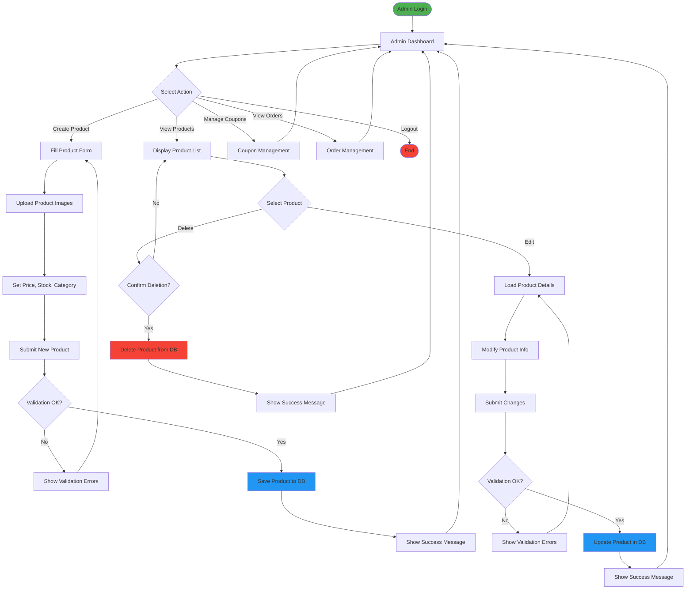

---

**Document Version**: 1.0  
**Last Updated**: December 26, 2025  
**Maintained By**: Development Team
