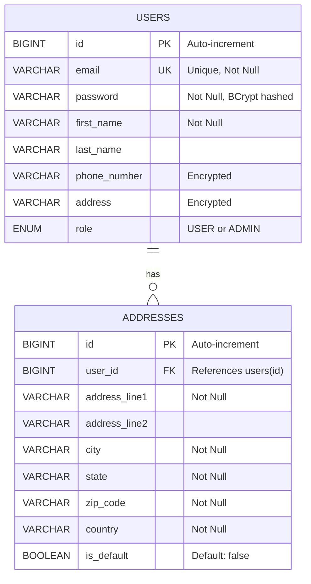
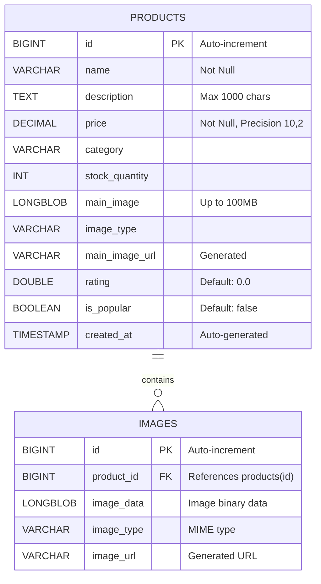
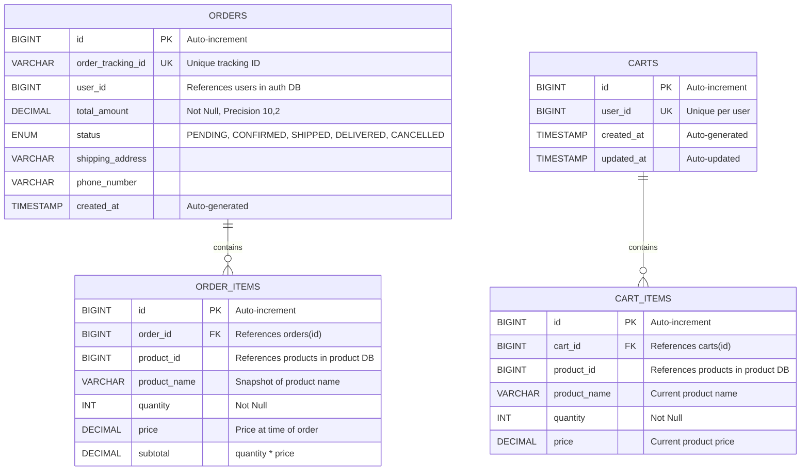
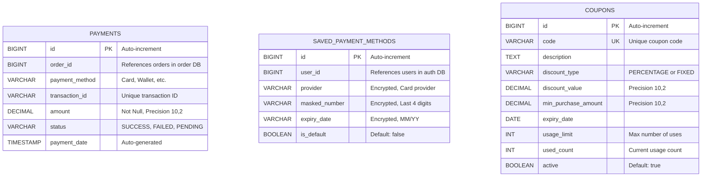
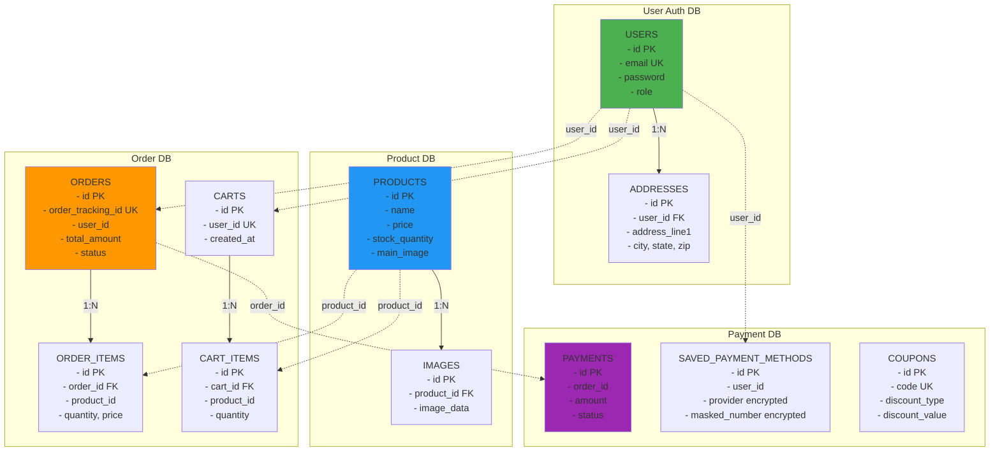

# Online Shopping System - Entity-Relationship (ER) Diagram

## Table of Contents
1. [Overview](#1-overview)
2. [User Auth Database](#2-user-auth-database)
3. [Product Database](#3-product-database)
4. [Order Database](#4-order-database)
5. [Payment Database](#5-payment-database)
6. [Complete System ER Diagram](#6-complete-system-er-diagram)
7. [Table Specifications](#7-table-specifications)

---

## 1. Overview

The Online Shopping System uses a **database-per-service** pattern where each microservice owns its database schema. This ensures loose coupling and independent scalability.

### Database Summary

| Database | Service | Tables | Purpose |
|----------|---------|--------|---------|
| **user_auth_db** | User Auth Service | users, addresses | User management and authentication |
| **product_db** | Product Service | products, images | Product catalog and images |
| **order_db** | Order Service | orders, order_items, carts, cart_items | Order and cart management |
| **payment_db** | Payment Service | payments, saved_payment_methods, coupons | Payment processing and coupons |

---

## 2. User Auth Database

### 2.1 ER Diagram - User Auth DB

### 2.2 Table Details

#### USERS Table
- **Primary Key**: `id` (BIGINT, Auto-increment)
- **Unique Constraints**: `email`
- **Encrypted Fields**: `phone_number`, `address` (AES-256 encryption)
- **Indexes**: 
  - Primary: `id`
  - Unique: `email`
- **Relationships**: One-to-Many with ADDRESSES

#### ADDRESSES Table
- **Primary Key**: `id` (BIGINT, Auto-increment)
- **Foreign Keys**: `user_id` → USERS(id)
- **Indexes**:
  - Primary: `id`
  - Foreign: `user_id`
- **Relationships**: Many-to-One with USERS

---

## 3. Product Database

### 3.1 ER Diagram - Product DB

### 3.2 Table Details

#### PRODUCTS Table
- **Primary Key**: `id` (BIGINT, Auto-increment)
- **Indexes**:
  - Primary: `id`
  - Index: `category` (for filtering)
  - Index: `created_at` (for sorting)
- **BLOB Storage**: `main_image` stores product images up to 100MB
- **Computed Field**: `main_image_url` generates URL dynamically
- **Relationships**: One-to-Many with IMAGES

#### IMAGES Table
- **Primary Key**: `id` (BIGINT, Auto-increment)
- **Foreign Keys**: `product_id` → PRODUCTS(id) with CASCADE delete
- **Indexes**:
  - Primary: `id`
  - Foreign: `product_id`
- **Relationships**: Many-to-One with PRODUCTS

---

## 4. Order Database

### 4.1 ER Diagram - Order DB

### 4.2 Table Details

#### ORDERS Table
- **Primary Key**: `id` (BIGINT, Auto-increment)
- **Unique Constraints**: `order_tracking_id`
- **Indexes**:
  - Primary: `id`
  - Unique: `order_tracking_id`
  - Index: `user_id` (for user order history)
  - Index: `status` (for filtering)
  - Index: `created_at` (for sorting)
- **Cross-Service Reference**: `user_id` references User Auth Service (no FK constraint)
- **Relationships**: One-to-Many with ORDER_ITEMS

#### ORDER_ITEMS Table
- **Primary Key**: `id` (BIGINT, Auto-increment)
- **Foreign Keys**: `order_id` → ORDERS(id) with CASCADE delete
- **Indexes**:
  - Primary: `id`
  - Foreign: `order_id`
- **Cross-Service Reference**: `product_id` references Product Service (no FK constraint)
- **Data Snapshot**: Stores product name and price at time of order
- **Relationships**: Many-to-One with ORDERS

#### CARTS Table
- **Primary Key**: `id` (BIGINT, Auto-increment)
- **Unique Constraints**: `user_id` (one cart per user)
- **Indexes**:
  - Primary: `id`
  - Unique: `user_id`
- **Relationships**: One-to-Many with CART_ITEMS

#### CART_ITEMS Table
- **Primary Key**: `id` (BIGINT, Auto-increment)
- **Foreign Keys**: `cart_id` → CARTS(id) with CASCADE delete
- **Indexes**:
  - Primary: `id`
  - Foreign: `cart_id`
- **Cross-Service Reference**: `product_id` references Product Service (no FK constraint)
- **Relationships**: Many-to-One with CARTS

---

## 5. Payment Database

### 5.1 ER Diagram - Payment DB

### 5.2 Table Details

#### PAYMENTS Table
- **Primary Key**: `id` (BIGINT, Auto-increment)
- **Indexes**:
  - Primary: `id`
  - Index: `order_id` (for order payment lookup)
  - Index: `transaction_id` (for transaction tracking)
  - Index: `payment_date` (for reporting)
- **Cross-Service Reference**: `order_id` references Order Service (no FK constraint)
- **Relationships**: One-to-One with ORDER (logical relationship)

#### SAVED_PAYMENT_METHODS Table
- **Primary Key**: `id` (BIGINT, Auto-increment)
- **Encrypted Fields**: `provider`, `masked_number`, `expiry_date` (AES-256)
- **Indexes**:
  - Primary: `id`
  - Index: `user_id` (for user payment methods)
- **Cross-Service Reference**: `user_id` references User Auth Service (no FK constraint)
- **Security**: All sensitive payment data is encrypted

#### COUPONS Table
- **Primary Key**: `id` (BIGINT, Auto-increment)
- **Unique Constraints**: `code`
- **Indexes**:
  - Primary: `id`
  - Unique: `code`
  - Index: `expiry_date` (for validation)
  - Index: `active` (for filtering)
- **Validation**: Checked against expiry date and usage limit
- **Admin-Only**: Only admins can create/modify coupons

---

## 6. Complete System ER Diagram

### 6.1 Cross-Service Relationships

**Legend**:
- Solid lines (→): Foreign key relationships within same database
- Dashed lines (-.->): Logical relationships across microservices (no FK constraints)

### 6.2 Cross-Service Data References

| Source Table | Field | Target Service | Target Table | Relationship Type |
|--------------|-------|----------------|--------------|-------------------|
| ORDERS | user_id | User Auth Service | USERS | Logical (no FK) |
| ORDER_ITEMS | product_id | Product Service | PRODUCTS | Logical (no FK) |
| CARTS | user_id | User Auth Service | USERS | Logical (no FK) |
| CART_ITEMS | product_id | Product Service | PRODUCTS | Logical (no FK) |
| PAYMENTS | order_id | Order Service | ORDERS | Logical (no FK) |
| SAVED_PAYMENT_METHODS | user_id | User Auth Service | USERS | Logical (no FK) |

**Note**: Cross-service references are maintained through API calls, not database foreign keys, to preserve service independence.

---

## 7. Table Specifications

### 7.1 Data Types and Constraints

#### Common Data Types
- **BIGINT**: Primary keys and foreign keys (64-bit integer)
- **VARCHAR**: String fields with specified max length
- **TEXT**: Long text fields (descriptions)
- **DECIMAL(10,2)**: Monetary values (10 digits, 2 decimal places)
- **LONGBLOB**: Binary large objects for images
- **TIMESTAMP**: Date and time with timezone
- **DATE**: Date only
- **ENUM**: Predefined set of values
- **BOOLEAN**: True/false values

#### Naming Conventions
- **Tables**: Plural, lowercase with underscores (e.g., `order_items`)
- **Columns**: Lowercase with underscores (e.g., `user_id`)
- **Primary Keys**: Always named `id`
- **Foreign Keys**: Named as `{table}_id` (e.g., `user_id`, `order_id`)
- **Timestamps**: `created_at`, `updated_at`

### 7.2 Indexes Strategy

#### Primary Indexes
- All tables have auto-increment `id` as primary key
- Clustered index on primary key for fast lookups

#### Unique Indexes
- `users.email`: Ensure unique user accounts
- `orders.order_tracking_id`: Unique order tracking
- `carts.user_id`: One cart per user
- `coupons.code`: Unique coupon codes

#### Foreign Key Indexes
- Automatic indexes on all foreign key columns
- Improves JOIN performance

#### Query Optimization Indexes
- `products.category`: Fast category filtering
- `products.created_at`: Sorting by newest
- `orders.user_id`: User order history
- `orders.status`: Filter by order status
- `payments.order_id`: Payment lookup by order

### 7.3 Data Encryption

#### Encrypted Fields (AES-256)
**User Auth DB**:
- `users.phone_number`
- `users.address`

**Payment DB**:
- `saved_payment_methods.provider`
- `saved_payment_methods.masked_number`
- `saved_payment_methods.expiry_date`

**Encryption Implementation**: JPA `@Convert` with custom `AttributeEncryptor` converter

### 7.4 Cascade Operations

#### CASCADE DELETE
- `ADDRESSES` when `USERS` deleted
- `IMAGES` when `PRODUCTS` deleted
- `ORDER_ITEMS` when `ORDERS` deleted
- `CART_ITEMS` when `CARTS` deleted

#### NO CASCADE (Cross-Service)
- Orders remain when user deleted (for audit trail)
- Order items remain when product deleted (historical data)
- Payments remain when order deleted (financial records)

### 7.5 Database Constraints

#### NOT NULL Constraints
- All primary keys
- User credentials (email, password)
- Product essentials (name, price)
- Order essentials (total_amount, status)
- Payment essentials (amount, status)

#### CHECK Constraints (Application Level)
- `products.price` > 0
- `products.stock_quantity` >= 0
- `order_items.quantity` > 0
- `coupons.discount_value` > 0
- `coupons.usage_limit` >= 0

#### DEFAULT Values
- `products.rating` = 0.0
- `products.is_popular` = false
- `addresses.is_default` = false
- `saved_payment_methods.is_default` = false
- `coupons.active` = true
- `coupons.used_count` = 0

---

## 8. Database Statistics (Estimated)

### 8.1 Expected Data Volume

| Table | Estimated Rows | Growth Rate | Storage Estimate |
|-------|----------------|-------------|------------------|
| USERS | 1M - 10M | Medium | 500MB - 5GB |
| ADDRESSES | 2M - 20M | Medium | 1GB - 10GB |
| PRODUCTS | 100K - 1M | Low | 50GB - 500GB (with images) |
| IMAGES | 300K - 3M | Low | 100GB - 1TB |
| ORDERS | 10M - 100M | High | 5GB - 50GB |
| ORDER_ITEMS | 30M - 300M | High | 10GB - 100GB |
| CARTS | 1M - 10M | Medium | 500MB - 5GB |
| CART_ITEMS | 3M - 30M | Medium | 1GB - 10GB |
| PAYMENTS | 10M - 100M | High | 3GB - 30GB |
| SAVED_PAYMENT_METHODS | 2M - 20M | Medium | 500MB - 5GB |
| COUPONS | 1K - 10K | Low | 1MB - 10MB |

### 8.2 Backup Strategy

- **Full Backup**: Daily at 2 AM
- **Incremental Backup**: Every 6 hours
- **Transaction Log Backup**: Every 15 minutes
- **Retention**: 30 days for full backups, 7 days for incremental
- **Disaster Recovery**: Cross-region replication

---

**Document Version**: 1.0  
**Last Updated**: December 26, 2025  
**Maintained By**: Database Team
