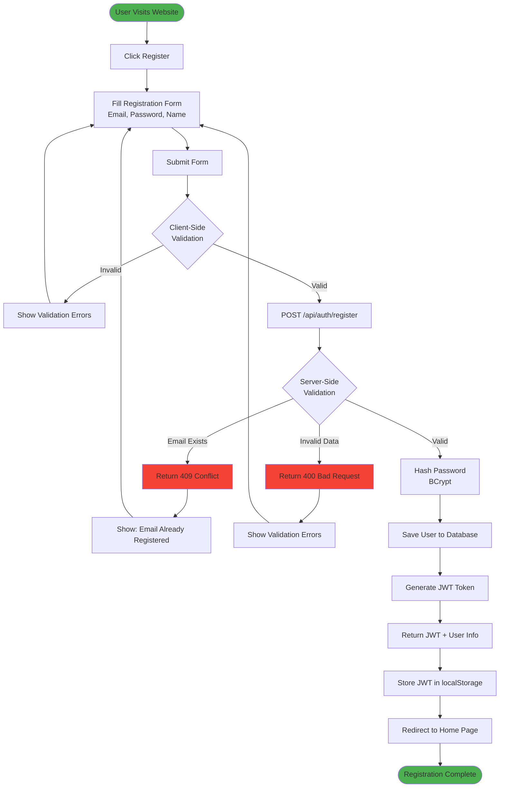
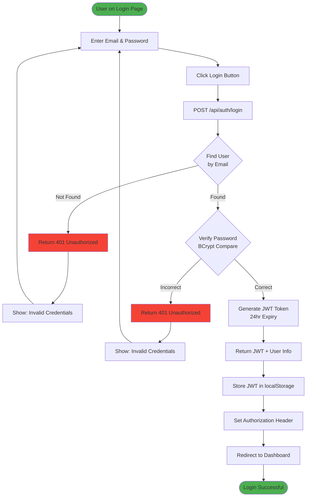
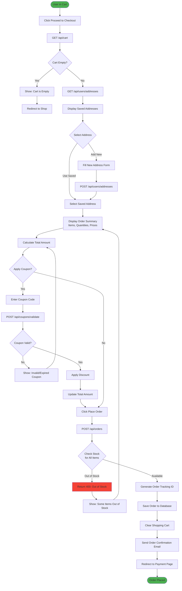
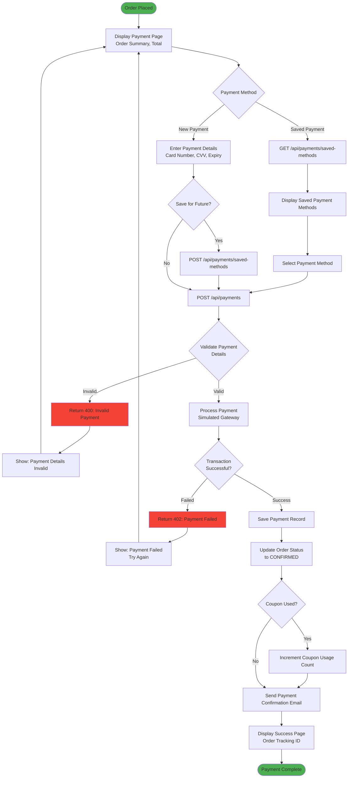
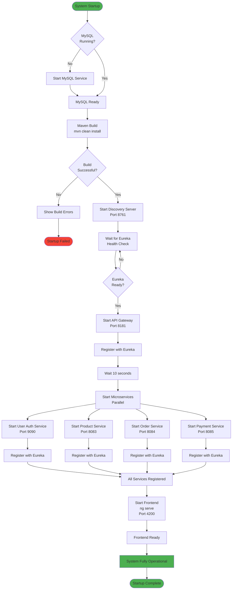
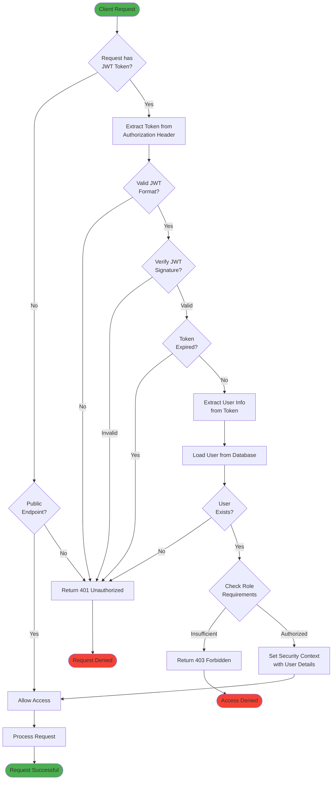
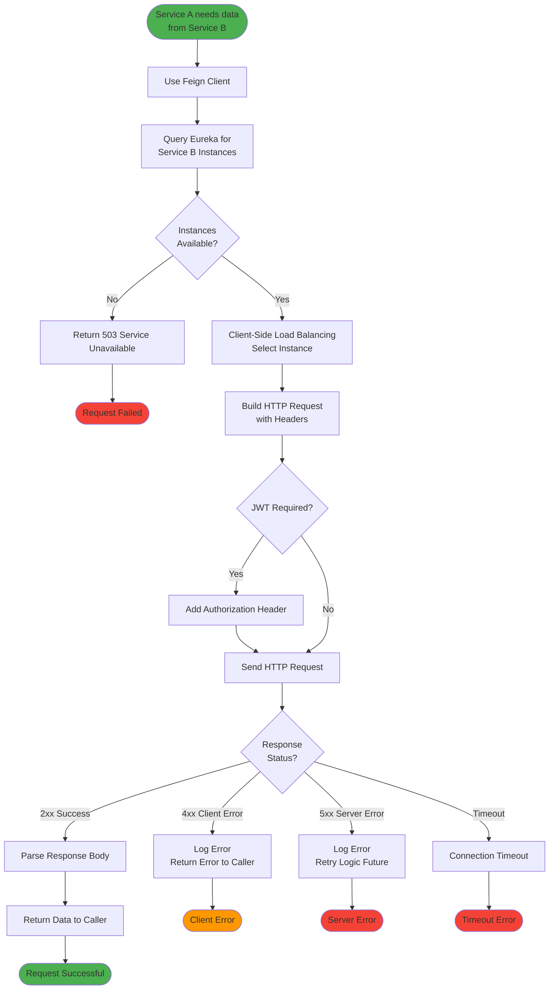
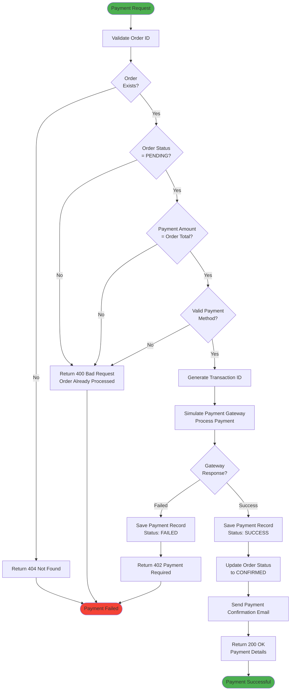
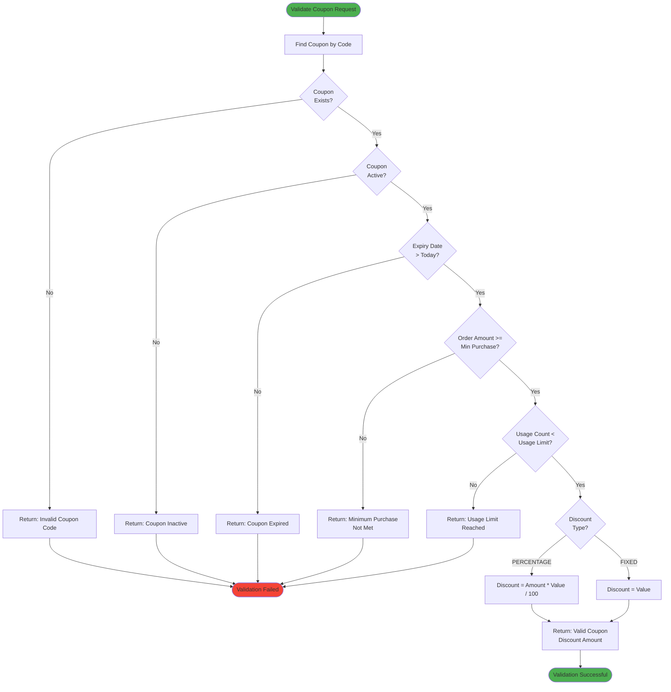
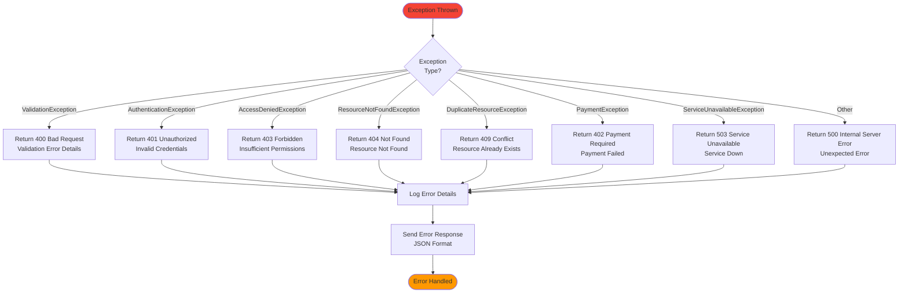

# Online Shopping System - Workflow Documentation

## Table of Contents
1. [User Workflows](#1-user-workflows)
2. [Admin Workflows](#2-admin-workflows)
3. [System Workflows](#3-system-workflows)
4. [Payment Workflows](#4-payment-workflows)
5. [Error Handling Workflows](#5-error-handling-workflows)

---

## 1. User Workflows

### 1.1 User Registration Workflow



### 1.2 User Login Workflow



### 1.3 Product Browsing and Search Workflow

```mermaid
flowchart TD
    Start([User on Home Page]) --> ViewProducts[GET /api/products]
    ViewProducts --> LoadProducts[Load All Products]
    LoadProducts --> DisplayGrid[Display Product Grid]
    
    DisplayGrid --> UserAction{User Action}
    
    UserAction -->|Search| EnterSearch[Enter Search Query]
    EnterSearch --> SearchAPI[GET /api/products?search=query]
    SearchAPI --> FilterResults[Filter Products by Name/Description]
    FilterResults --> DisplayGrid
    
    UserAction -->|Filter by Category| SelectCategory[Select Category]
    SelectCategory --> FilterAPI[GET /api/products?category=X]
    FilterAPI --> FilterByCategory[Filter Products by Category]
    FilterByCategory --> DisplayGrid
    
    UserAction -->|Sort| SelectSort[Select Sort Option]
    SelectSort --> SortProducts[Sort by Price/Name/Date]
    SortProducts --> DisplayGrid
    
    UserAction -->|View Details| ClickProduct[Click Product Card]
    ClickProduct --> ViewDetail[Navigate to Product Detail Page]
    ViewDetail --> LoadDetail[GET /api/products/{id}]
    LoadDetail --> ShowDetail[Display Product Details<br/>Images, Description, Price, Stock]
    
    ShowDetail --> DetailAction{User Action}
    DetailAction -->|Add to Cart| AddToCart[Add to Cart Workflow]
    DetailAction -->|Back| DisplayGrid
    DetailAction -->|Buy Now| DirectCheckout[Direct to Checkout]
    
    style Start fill:#4CAF50
```

### 1.4 Shopping Cart Workflow

```mermaid
flowchart TD
    Start([User Logged In]) --> AddItem[Click Add to Cart]
    AddItem --> CheckAuth{Authenticated?}
    
    CheckAuth -->|No| RedirectLogin[Redirect to Login]
    RedirectLogin --> LoginFlow[Login Workflow]
    LoginFlow --> AddItem
    
    CheckAuth -->|Yes| SendAdd[POST /api/cart<br/>productId, quantity]
    SendAdd --> GetCart{Cart Exists?}
    
    GetCart -->|No| CreateCart[Create New Cart]
    CreateCart --> AddCartItem[Add Cart Item]
    
    GetCart -->|Yes| CheckItem{Item in Cart?}
    CheckItem -->|Yes| UpdateQty[Update Quantity]
    CheckItem -->|No| AddCartItem
    
    AddCartItem --> SaveCart[Save to Database]
    UpdateQty --> SaveCart
    SaveCart --> ShowSuccess[Show Success Message]
    ShowSuccess --> UpdateBadge[Update Cart Badge Count]
    
    UpdateBadge --> UserChoice{User Choice}
    UserChoice -->|Continue Shopping| Browse[Browse More Products]
    UserChoice -->|View Cart| ViewCart[GET /api/cart]
    
    ViewCart --> DisplayCart[Display Cart Items<br/>Product, Quantity, Price, Subtotal]
    DisplayCart --> CartAction{Cart Action}
    
    CartAction -->|Update Quantity| ChangeQty[Change Quantity Input]
    ChangeQty --> UpdateAPI[PUT /api/cart/items/{id}]
    UpdateAPI --> RecalculateCart[Recalculate Totals]
    RecalculateCart --> DisplayCart
    
    CartAction -->|Remove Item| ClickRemove[Click Remove]
    ClickRemove --> ConfirmRemove{Confirm?}
    ConfirmRemove -->|No| DisplayCart
    ConfirmRemove -->|Yes| RemoveAPI[DELETE /api/cart/items/{id}]
    RemoveAPI --> RecalculateCart
    
    CartAction -->|Proceed to Checkout| Checkout[Checkout Workflow]
    CartAction -->|Continue Shopping| Browse
    
    style Start fill:#4CAF50
```

### 1.5 Checkout and Order Placement Workflow



### 1.6 Payment Workflow



### 1.7 Order Tracking Workflow

```mermaid
flowchart TD
    Start([User Logged In]) --> OrdersPage[Navigate to My Orders]
    OrdersPage --> GetOrders[GET /api/orders]
    GetOrders --> DisplayOrders[Display Order List<br/>Tracking ID, Date, Status, Total]
    
    DisplayOrders --> SelectOrder[Click on Order]
    SelectOrder --> GetOrderDetail[GET /api/orders/{id}]
    GetOrderDetail --> ShowOrderDetail[Display Order Details<br/>Items, Quantities, Prices<br/>Shipping Address, Status]
    
    ShowOrderDetail --> StatusCheck{Order Status}
    StatusCheck -->|PENDING| ShowPending[Show: Order Being Processed]
    StatusCheck -->|CONFIRMED| ShowConfirmed[Show: Order Confirmed<br/>Preparing for Shipment]
    StatusCheck -->|SHIPPED| ShowShipped[Show: Order Shipped<br/>Estimated Delivery Date]
    StatusCheck -->|DELIVERED| ShowDelivered[Show: Order Delivered]
    StatusCheck -->|CANCELLED| ShowCancelled[Show: Order Cancelled]
    
    ShowOrderDetail --> ActionChoice{User Action}
    ActionChoice -->|Cancel Order| CheckCancelable{Status = PENDING?}
    CheckCancelable -->|No| ShowCancelError[Show: Cannot Cancel<br/>Order Already Processed]
    CheckCancelable -->|Yes| ConfirmCancel{Confirm<br/>Cancellation?}
    ConfirmCancel -->|No| ShowOrderDetail
    ConfirmCancel -->|Yes| CancelOrder[PUT /api/orders/{id}/cancel]
    CancelOrder --> UpdateStatus[Update Status to CANCELLED]
    UpdateStatus --> RefundPayment[Initiate Refund Process]
    RefundPayment --> SendCancelEmail[Send Cancellation Email]
    SendCancelEmail --> ShowOrderDetail
    
    ActionChoice -->|View Invoice| GenerateInvoice[Generate PDF Invoice]
    GenerateInvoice --> DownloadInvoice[Download Invoice]
    
    ActionChoice -->|Back to Orders| DisplayOrders
    
    style Start fill:#4CAF50
```

---

## 2. Admin Workflows

### 2.1 Product Management Workflow

```mermaid
flowchart TD
    Start([Admin Login]) --> Dashboard[Admin Dashboard]
    Dashboard --> ProductMgmt[Navigate to Product Management]
    ProductMgmt --> Action{Select Action}
    
    Action -->|Create| CreateForm[Click Add New Product]
    CreateForm --> FillDetails[Fill Product Details<br/>Name, Description, Price<br/>Category, Stock]
    FillDetails --> UploadImages[Upload Product Images<br/>Main Image + Additional]
    UploadImages --> SubmitCreate[Submit Create Form]
    SubmitCreate --> ValidateCreate{Validate Input}
    
    ValidateCreate -->|Invalid| ShowCreateError[Show Validation Errors]
    ShowCreateError --> FillDetails
    
    ValidateCreate -->|Valid| ProcessImages[Process and Compress Images]
    ProcessImages --> SaveProduct[POST /api/products]
    SaveProduct --> ProductCreated[Product Created Successfully]
    ProductCreated --> ProductMgmt
    
    Action -->|View/Edit| ListProducts[GET /api/products]
    ListProducts --> DisplayList[Display Product List<br/>with Edit/Delete Options]
    DisplayList --> SelectProduct{Select Product}
    
    SelectProduct -->|Edit| LoadProduct[GET /api/products/{id}]
    LoadProduct --> EditForm[Display Edit Form<br/>Pre-filled with Product Data]
    EditForm --> ModifyDetails[Modify Product Details]
    ModifyDetails --> UpdateImages{Update Images?}
    UpdateImages -->|Yes| UploadNewImages[Upload New Images]
    UploadNewImages --> SubmitUpdate
    UpdateImages -->|No| SubmitUpdate[Submit Update Form]
    SubmitUpdate --> ValidateUpdate{Validate Input}
    
    ValidateUpdate -->|Invalid| ShowUpdateError[Show Validation Errors]
    ShowUpdateError --> EditForm
    
    ValidateUpdate -->|Valid| UpdateProduct[PUT /api/products/{id}]
    UpdateProduct --> ProductUpdated[Product Updated Successfully]
    ProductUpdated --> ProductMgmt
    
    SelectProduct -->|Delete| ConfirmDelete{Confirm<br/>Deletion?}
    ConfirmDelete -->|No| DisplayList
    ConfirmDelete -->|Yes| CheckOrders{Product in<br/>Active Orders?}
    CheckOrders -->|Yes| ShowDeleteWarning[Show: Cannot Delete<br/>Product in Active Orders]
    ShowDeleteWarning --> DisplayList
    CheckOrders -->|No| DeleteProduct[DELETE /api/products/{id}]
    DeleteProduct --> ProductDeleted[Product Deleted Successfully]
    ProductDeleted --> ProductMgmt
    
    style Start fill:#FF5722
    style ProductCreated fill:#4CAF50
    style ProductUpdated fill:#4CAF50
    style ProductDeleted fill:#4CAF50
```

### 2.2 Coupon Management Workflow

```mermaid
flowchart TD
    Start([Admin Dashboard]) --> CouponMgmt[Navigate to Coupon Management]
    CouponMgmt --> Action{Select Action}
    
    Action -->|Create| CreateForm[Click Add New Coupon]
    CreateForm --> FillCoupon[Fill Coupon Details<br/>Code, Description<br/>Discount Type, Value<br/>Min Purchase, Expiry<br/>Usage Limit]
    FillCoupon --> SubmitCreate[Submit Create Form]
    SubmitCreate --> ValidateCreate{Validate Input}
    
    ValidateCreate -->|Invalid| ShowCreateError[Show Validation Errors<br/>- Code must be unique<br/>- Discount value > 0<br/>- Valid expiry date]
    ShowCreateError --> FillCoupon
    
    ValidateCreate -->|Valid| SaveCoupon[POST /api/coupons]
    SaveCoupon --> CouponCreated[Coupon Created Successfully]
    CouponCreated --> CouponMgmt
    
    Action -->|View/Edit| ListCoupons[GET /api/coupons]
    ListCoupons --> DisplayList[Display Coupon List<br/>Code, Discount, Expiry<br/>Usage, Status]
    DisplayList --> SelectCoupon{Select Coupon}
    
    SelectCoupon -->|Edit| LoadCoupon[GET /api/coupons/{id}]
    LoadCoupon --> EditForm[Display Edit Form<br/>Pre-filled with Coupon Data]
    EditForm --> ModifyCoupon[Modify Coupon Details]
    ModifyCoupon --> SubmitUpdate[Submit Update Form]
    SubmitUpdate --> ValidateUpdate{Validate Input}
    
    ValidateUpdate -->|Invalid| ShowUpdateError[Show Validation Errors]
    ShowUpdateError --> EditForm
    
    ValidateUpdate -->|Valid| UpdateCoupon[PUT /api/coupons/{id}]
    UpdateCoupon --> CouponUpdated[Coupon Updated Successfully]
    CouponUpdated --> CouponMgmt
    
    SelectCoupon -->|Delete| ConfirmDelete{Confirm<br/>Deletion?}
    ConfirmDelete -->|No| DisplayList
    ConfirmDelete -->|Yes| DeleteCoupon[DELETE /api/coupons/{id}]
    DeleteCoupon --> CouponDeleted[Coupon Deleted Successfully]
    CouponDeleted --> CouponMgmt
    
    SelectCoupon -->|Toggle Active| ToggleStatus[Toggle Active Status]
    ToggleStatus --> UpdateStatus[PUT /api/coupons/{id}]
    UpdateStatus --> StatusUpdated[Status Updated]
    StatusUpdated --> DisplayList
    
    style Start fill:#FF5722
    style CouponCreated fill:#4CAF50
    style CouponUpdated fill:#4CAF50
    style CouponDeleted fill:#4CAF50
```

### 2.3 Order Management Workflow (Admin)

```mermaid
flowchart TD
    Start([Admin Dashboard]) --> OrderMgmt[Navigate to Order Management]
    OrderMgmt --> GetAllOrders[GET /api/orders/all]
    GetAllOrders --> DisplayOrders[Display All Orders<br/>Tracking ID, User, Date<br/>Status, Total]
    
    DisplayOrders --> FilterOrders{Filter Options}
    FilterOrders -->|By Status| FilterStatus[Filter by PENDING/<br/>CONFIRMED/SHIPPED/<br/>DELIVERED/CANCELLED]
    FilterOrders -->|By Date| FilterDate[Filter by Date Range]
    FilterOrders -->|By User| FilterUser[Filter by User Email]
    FilterStatus --> DisplayOrders
    FilterDate --> DisplayOrders
    FilterUser --> DisplayOrders
    
    DisplayOrders --> SelectOrder[Click on Order]
    SelectOrder --> GetOrderDetail[GET /api/orders/{id}]
    GetOrderDetail --> ShowDetail[Display Order Details<br/>User Info, Items<br/>Shipping Address<br/>Payment Status]
    
    ShowDetail --> AdminAction{Admin Action}
    
    AdminAction -->|Update Status| SelectStatus[Select New Status]
    SelectStatus --> ValidateTransition{Valid Status<br/>Transition?}
    ValidateTransition -->|No| ShowTransitionError[Show: Invalid Status Change]
    ShowTransitionError --> ShowDetail
    ValidateTransition -->|Yes| UpdateStatus[PUT /api/orders/{id}/status]
    UpdateStatus --> SendNotification[Send Status Update Email]
    SendNotification --> StatusUpdated[Status Updated Successfully]
    StatusUpdated --> ShowDetail
    
    AdminAction -->|View Customer| GetCustomer[GET /api/users/{userId}]
    GetCustomer --> ShowCustomer[Display Customer Details]
    ShowCustomer --> ShowDetail
    
    AdminAction -->|Print Invoice| GenerateInvoice[Generate PDF Invoice]
    GenerateInvoice --> PrintInvoice[Print/Download Invoice]
    
    AdminAction -->|Back to List| DisplayOrders
    
    style Start fill:#FF5722
    style StatusUpdated fill:#4CAF50
```

---

## 3. System Workflows

### 3.1 Service Startup Workflow



### 3.2 JWT Authentication Workflow



### 3.3 Inter-Service Communication Workflow



---

## 4. Payment Workflows

### 4.1 Payment Processing Workflow (Detailed)



### 4.2 Coupon Validation Workflow



---

## 5. Error Handling Workflows

### 5.1 Global Error Handling Workflow



---

**Document Version**: 1.0  
**Last Updated**: December 26, 2025  
**Maintained By**: Development Team
