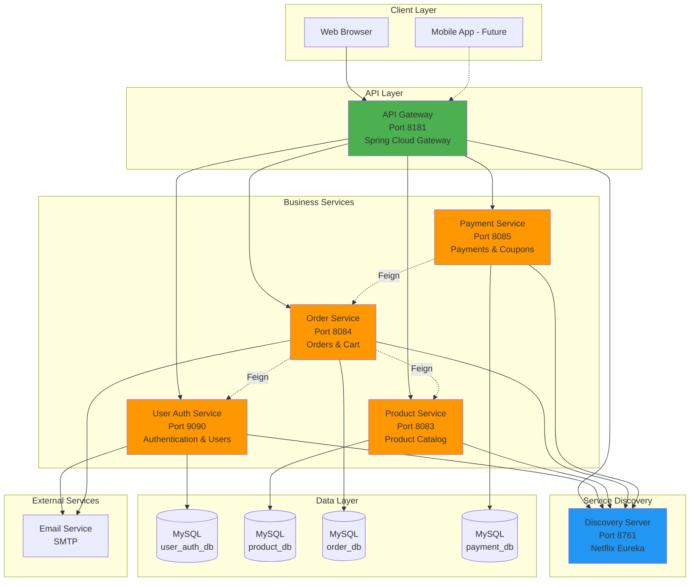
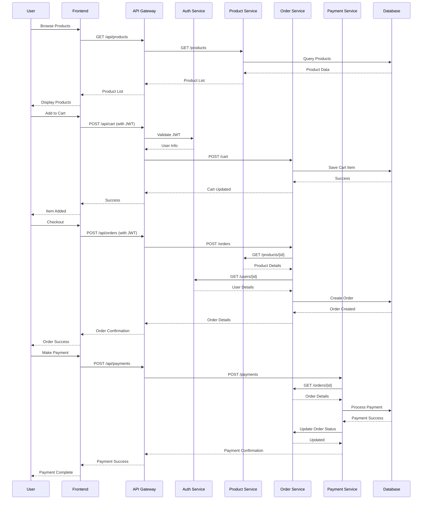
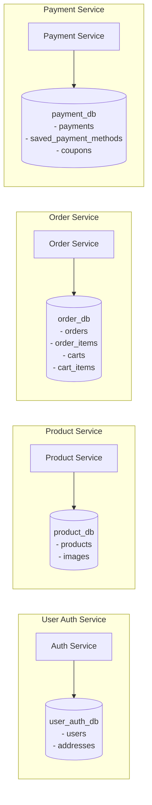
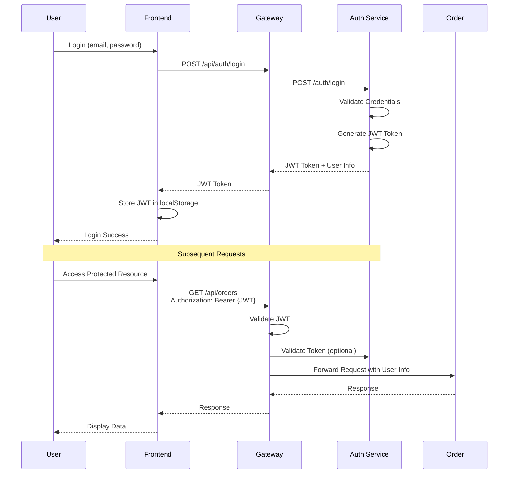
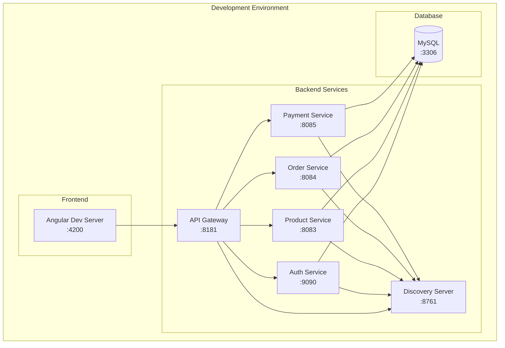

# Online Shopping System - Architecture Documentation

## Table of Contents
1. [Architecture Overview](#architecture-overview)
2. [Microservices Architecture](#microservices-architecture)
3. [Component Details](#component-details)
4. [Communication Patterns](#communication-patterns)
5. [Data Architecture](#data-architecture)
6. [Security Architecture](#security-architecture)
7. [Deployment Architecture](#deployment-architecture)
8. [Scalability & Performance](#scalability--performance)

---

## 1. Architecture Overview

The Online Shopping System follows a **microservices architecture** pattern, decomposed by business capabilities. Each service is independently deployable, scalable, and maintainable.

### 1.1 High-Level Architecture Diagram



### 1.2 Architecture Principles

1. **Service Independence**: Each microservice is independently deployable and scalable
2. **Database per Service**: Each service owns its data and database schema
3. **API-First Design**: Well-defined REST APIs for all inter-service communication
4. **Decentralized Data Management**: No shared databases between services
5. **Fault Isolation**: Failure in one service doesn't cascade to others
6. **Technology Diversity**: Services can use different tech stacks if needed

---

## 2. Microservices Architecture

### 2.1 Service Catalog

| Service | Port | Responsibility | Database | Dependencies |
|---------|------|----------------|----------|--------------|
| **Discovery Server** | 8761 | Service registry and discovery | None | None |
| **API Gateway** | 8181 | Routing, load balancing, authentication | None | Discovery Server |
| **User Auth Service** | 9090 | User management, authentication, authorization | user_auth_db | Email Service |
| **Product Service** | 8083 | Product catalog, inventory, images | product_db | None |
| **Order Service** | 8084 | Shopping cart, order management | order_db | Product Service, User Auth Service, Email Service |
| **Payment Service** | 8085 | Payment processing, coupons | payment_db | Order Service |
| **Frontend** | 4200 | User interface (Angular) | None | API Gateway |

### 2.2 Service Interaction Diagram



---

## 3. Component Details

### 3.1 Discovery Server (Eureka)

**Technology**: Netflix Eureka Server  
**Port**: 8761  
**Purpose**: Service registry and discovery

**Key Features**:
- Service registration and health monitoring
- Client-side load balancing
- Automatic service discovery
- Heartbeat mechanism for service health

**Configuration**:
```properties
eureka.client.register-with-eureka=false
eureka.client.fetch-registry=false
```

### 3.2 API Gateway

**Technology**: Spring Cloud Gateway  
**Port**: 8181  
**Purpose**: Single entry point for all client requests

**Key Features**:
- Request routing to appropriate microservices
- Load balancing across service instances
- CORS configuration
- Request/response filtering
- Circuit breaker pattern (future)

**Routing Configuration**:
- `/api/auth/**` → User Auth Service
- `/api/users/**` → User Auth Service
- `/api/products/**` → Product Service
- `/api/cart/**` → Order Service
- `/api/orders/**` → Order Service
- `/api/payments/**` → Payment Service
- `/api/coupons/**` → Payment Service

### 3.3 User Auth Service

**Technology**: Spring Boot + Spring Security + JWT  
**Port**: 9090  
**Database**: user_auth_db

**Entities**:
- `User`: User accounts with encrypted sensitive data
- `Address`: Multiple shipping addresses per user
- `Role`: ENUM (USER, ADMIN)

**Key Features**:
- JWT-based authentication
- BCrypt password hashing
- Role-based access control (RBAC)
- User profile management
- Address management
- Email notifications

**Security**:
- Sensitive data encryption (phone, address)
- Password strength validation
- JWT token expiration (24 hours)

### 3.4 Product Service

**Technology**: Spring Boot + JPA  
**Port**: 8083  
**Database**: product_db

**Entities**:
- `Product`: Product catalog with images
- `Image`: Additional product images

**Key Features**:
- Product CRUD operations
- Image upload and storage (BLOB)
- Category management
- Stock quantity tracking
- Product search and filtering
- Image URL generation

**API Endpoints**:
- `GET /products` - List all products
- `GET /products/{id}` - Get product details
- `GET /products/{id}/image` - Get product image
- `POST /products` - Create product (Admin)
- `PUT /products/{id}` - Update product (Admin)
- `DELETE /products/{id}` - Delete product (Admin)

### 3.5 Order Service

**Technology**: Spring Boot + JPA + OpenFeign  
**Port**: 8084  
**Database**: order_db

**Entities**:
- `Order`: Customer orders
- `OrderItem`: Line items in an order
- `Cart`: Shopping cart
- `CartItem`: Items in cart
- `OrderStatus`: ENUM (PENDING, CONFIRMED, SHIPPED, DELIVERED, CANCELLED)

**Key Features**:
- Shopping cart management
- Order creation and tracking
- Order status updates
- Order history
- Email notifications for orders
- Integration with Product and User services via Feign

**Inter-Service Communication**:
- Calls Product Service to validate products and check stock
- Calls User Auth Service to get user details
- Sends order confirmation emails

### 3.6 Payment Service

**Technology**: Spring Boot + JPA + OpenFeign  
**Port**: 8085  
**Database**: payment_db

**Entities**:
- `Payment`: Payment transactions
- `SavedPaymentMethod`: Saved payment methods (encrypted)
- `Coupon`: Promotional coupons

**Key Features**:
- Payment processing (simulated)
- Multiple payment methods support
- Saved payment methods (encrypted)
- Coupon management (Admin)
- Coupon validation and application
- Transaction tracking

**Coupon Features**:
- Percentage and fixed amount discounts
- Expiration date validation
- Usage limit tracking
- Admin-only coupon management

---

## 4. Communication Patterns

### 4.1 Synchronous Communication

**Technology**: REST APIs with OpenFeign

**Pattern**: Request-Response

**Use Cases**:
- Order Service → Product Service (validate products)
- Order Service → User Auth Service (get user details)
- Payment Service → Order Service (update order status)

**Example Feign Client**:
```java
@FeignClient(name = "PRODUCT-SERVICE")
public interface ProductClient {
    @GetMapping("/products/{id}")
    ProductDTO getProductById(@PathVariable Long id);
}
```

### 4.2 Service Discovery Pattern

All services register with Eureka Discovery Server:
1. Service starts and registers with Eureka
2. Sends heartbeat every 30 seconds
3. Eureka maintains service registry
4. Clients query Eureka for service locations
5. Client-side load balancing via Ribbon

### 4.3 API Gateway Pattern

All client requests go through API Gateway:
1. Client sends request to Gateway
2. Gateway authenticates request (JWT validation)
3. Gateway discovers service location from Eureka
4. Gateway routes request to appropriate service
5. Gateway returns response to client

---

## 5. Data Architecture

### 5.1 Database per Service Pattern

Each microservice has its own MySQL database:



### 5.2 Data Consistency

**Approach**: Eventual Consistency

**Strategies**:
- Each service owns its data
- No direct database access between services
- Data synchronization via API calls
- Transactional boundaries within services
- Compensating transactions for distributed operations

### 5.3 Data Encryption

**Encrypted Fields**:
- User phone numbers (AttributeEncryptor)
- User addresses (AttributeEncryptor)
- Saved payment methods (AttributeEncryptor)

**Encryption Method**: AES-256 (configured via JPA converters)

---

## 6. Security Architecture

### 6.1 Authentication Flow



### 6.2 Authorization

**Role-Based Access Control (RBAC)**:
- **USER**: Can browse products, manage cart, place orders, make payments
- **ADMIN**: All USER permissions + manage products, manage coupons, view all orders

**Implementation**:
- Spring Security with `@PreAuthorize` annotations
- JWT contains user role
- Each service validates permissions independently

### 6.3 Security Layers

1. **Transport Security**: HTTPS (TLS 1.3) - planned for production
2. **Authentication**: JWT tokens with 24-hour expiration
3. **Authorization**: Role-based access control
4. **Data Encryption**: Sensitive data encrypted at rest
5. **Password Security**: BCrypt hashing with salt
6. **CORS**: Configured to allow frontend origin
7. **SQL Injection Protection**: Parameterized queries via JPA

---

## 7. Deployment Architecture

### 7.1 Current Deployment (Development)



**Deployment Method**: JAR files running as Java processes

**Startup Sequence**:
1. MySQL Database
2. Discovery Server (Eureka)
3. API Gateway
4. Business Services (Auth, Product, Order, Payment) - parallel
5. Frontend Application

### 7.2 Production Deployment (Planned)

```mermaid
graph TB
    subgraph "Load Balancer"
        LB[Load Balancer]
    end

    subgraph "Kubernetes Cluster"
        subgraph "Gateway Pods"
            GW1[API Gateway]
            GW2[API Gateway]
        end

        subgraph "Service Pods"
            AUTH1[Auth Service]
            AUTH2[Auth Service]
            PROD1[Product Service]
            PROD2[Product Service]
            ORD1[Order Service]
            ORD2[Order Service]
            PAY1[Payment Service]
            PAY2[Payment Service]
        end

        subgraph "Discovery"
            EUR1[Eureka Server]
            EUR2[Eureka Server]
        end
    end

    subgraph "Database Cluster"
        DB_MASTER[(MySQL Master)]
        DB_SLAVE1[(MySQL Slave)]
        DB_SLAVE2[(MySQL Slave)]
    end

    subgraph "CDN"
        CDN[CDN for Static Assets]
    end

    LB --> GW1
    LB --> GW2

    GW1 --> EUR1
    GW2 --> EUR2

    AUTH1 --> DB_MASTER
    AUTH2 --> DB_SLAVE1
    PROD1 --> DB_MASTER
    PROD2 --> DB_SLAVE1

    DB_MASTER --> DB_SLAVE1
    DB_MASTER --> DB_SLAVE2
```

**Planned Technologies**:
- **Containerization**: Docker
- **Orchestration**: Kubernetes
- **Service Mesh**: Istio (optional)
- **Monitoring**: Prometheus + Grafana
- **Logging**: ELK Stack
- **CI/CD**: Jenkins or GitHub Actions

---

## 8. Scalability & Performance

### 8.1 Horizontal Scaling

**Stateless Services**: All microservices are stateless, enabling easy horizontal scaling

**Scaling Strategy**:
- Auto-scaling based on CPU/memory metrics
- Load balancing via Kubernetes or cloud provider
- Database read replicas for read-heavy operations

### 8.2 Performance Optimizations

1. **Connection Pooling**: HikariCP for efficient database connections
2. **Lazy Loading**: JPA lazy loading for related entities
3. **Caching**: Strategic caching for product catalog (planned)
4. **Image Optimization**: Image compression and CDN delivery (planned)
5. **Database Indexing**: Indexes on frequently queried columns

### 8.3 Resilience Patterns

**Planned Implementations**:
- **Circuit Breaker**: Prevent cascading failures (Resilience4j)
- **Retry Logic**: Automatic retry for transient failures
- **Timeout Configuration**: Prevent hanging requests
- **Bulkhead Pattern**: Isolate thread pools per service
- **Health Checks**: Kubernetes liveness and readiness probes

### 8.4 Monitoring & Observability

**Planned Tools**:
- **Metrics**: Prometheus for metrics collection
- **Visualization**: Grafana dashboards
- **Distributed Tracing**: Zipkin or Jaeger
- **Logging**: Centralized logging with ELK Stack
- **Alerting**: Alert manager for critical issues

---

## 9. Technology Decisions & Rationale

| Technology | Rationale |
|------------|-----------|
| **Spring Boot** | Industry-standard, production-ready, extensive ecosystem |
| **Microservices** | Scalability, fault isolation, independent deployment |
| **Netflix Eureka** | Mature service discovery, Spring Cloud integration |
| **Spring Cloud Gateway** | Native Spring integration, reactive, flexible routing |
| **JWT** | Stateless authentication, scalable, cross-domain support |
| **MySQL** | ACID compliance, mature, excellent Spring Boot support |
| **OpenFeign** | Declarative REST clients, Spring Cloud integration |
| **Angular** | Component-based, TypeScript support, enterprise-ready |
| **Maven** | Dependency management, multi-module projects |

---

## 10. Future Architecture Enhancements

1. **Event-Driven Architecture**: Implement Kafka for asynchronous communication
2. **CQRS Pattern**: Separate read and write models for complex queries
3. **API Versioning**: Support multiple API versions
4. **GraphQL**: Alternative to REST for flexible data fetching
5. **Service Mesh**: Istio for advanced traffic management
6. **Serverless Functions**: AWS Lambda for specific use cases
7. **Multi-Region Deployment**: Global distribution for low latency

---

**Document Version**: 1.0  
**Last Updated**: December 26, 2025  
**Maintained By**: Architecture Team
